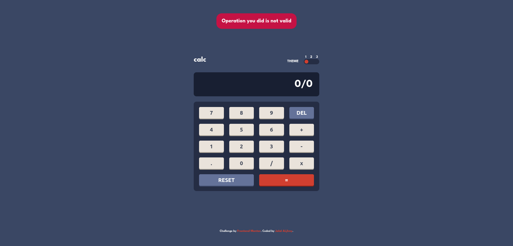
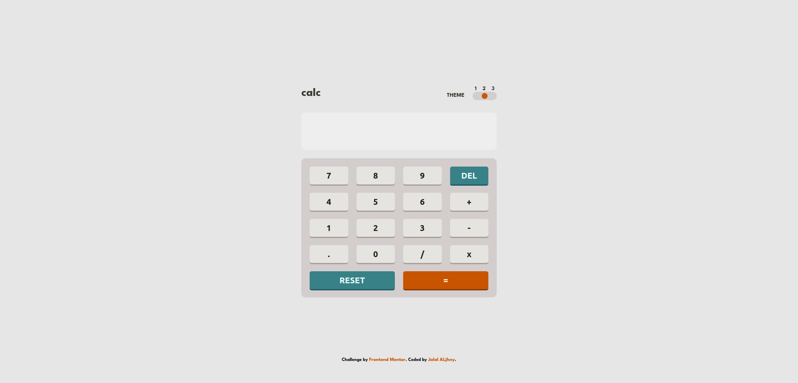
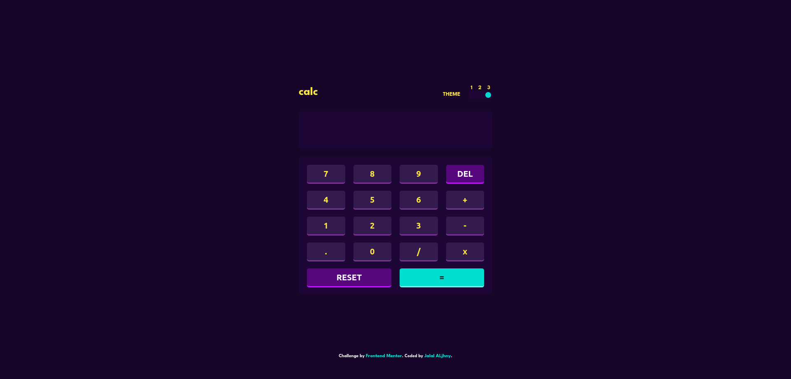

# Frontend Mentor - Calculator app solution

This is a solution to the [Calculator app challenge on Frontend Mentor](https://www.frontendmentor.io/challenges/calculator-app-9lteq5N29). Frontend Mentor challenges help you improve your coding skills by building realistic projects.

## Table of contents

- [Overview](#overview)
  - [The challenge](#the-challenge)
  - [Screenshot](#screenshot)
  - [Links](#links)
- [My process](#my-process)
  - [Features](#features)
- [Author](#author)
- [Acknowledgments](#acknowledgments)

## Overview

### The challenge

Users should be able to:

- See the size of the elements adjust based on their device's screen size
- Perform mathmatical operations like addition, subtraction, multiplication, and division
- Adjust the color theme based on their preference
- **Bonus**: Have their initial theme preference checked using `prefers-color-scheme` and have any additional changes saved in the browser

### Screenshot

### Links

- Solution URL: [Solution URL](https://github.com/Jalal-Aljhny/Frontend-Mentor-Calculator-app)
- Live Site URL: [Live site URL](https://jalal-aljhny.github.io/Frontend-Mentor-Calculator-app/)

## My process

### Features

- Perform mathematical operations like addition, subtraction, multiplication, and division
- Easy to develop to contains all complex operations
- Have three themes
- Users have their initial theme preference checked using `prefers-color-scheme` and can change the themes , changes saved in the browser and the can change using drag and drop or buttoms
- Error message will appear if user input wrong operation

## Author

- Frontend Mentor - [@Jalal-Aljhny](https://www.frontendmentor.io/profile/Jalal-Aljhny)
